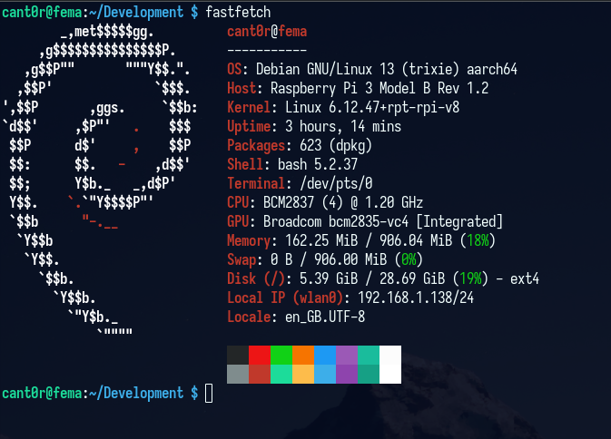
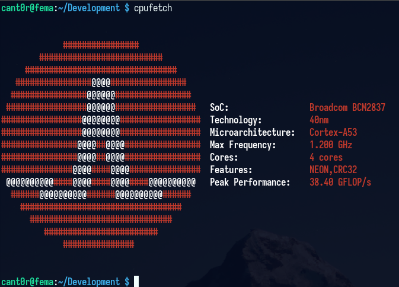

# Advent Of Code

These are my attempts on Advent Of Code throughout the years. None of them were completed so far due to _stuff_ :^).

For all the attempted years, I have tried to setup some small "challenges" up for me like running the various challenges on resource constrained platforms. These artificial difficulties can be seen below in the table:

| Year | Targeted Language(s) | System | `fastfetch` | `cpufetch` |
|:----:|:--------------------:|:-------|:-----------:|:----------:|
| 2025 | Go | Raspberry Pi 3 |  |  |
| 2024 | C# | Lenovo laptop |  |  |